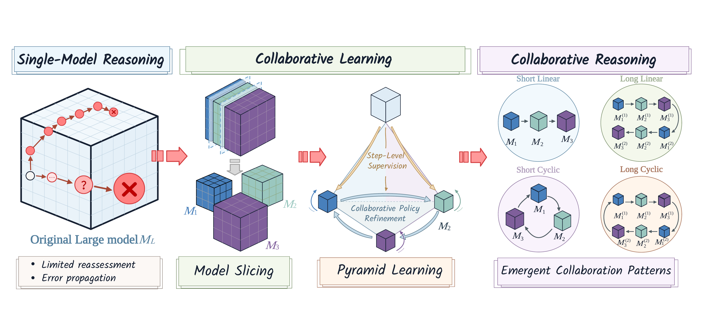
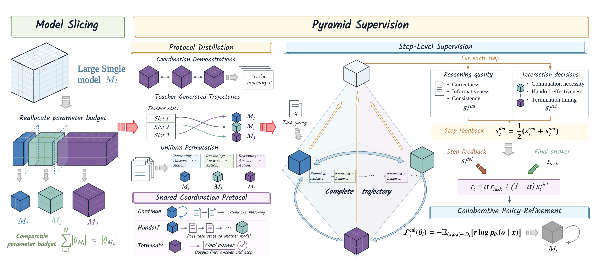
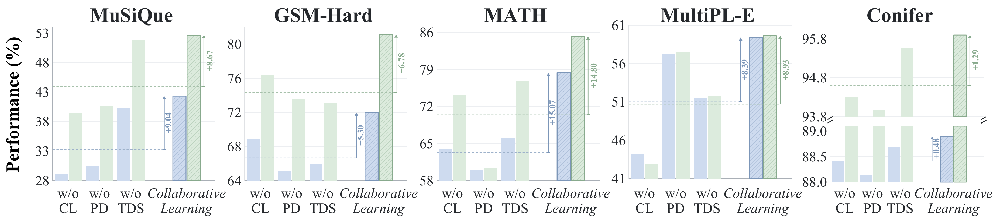
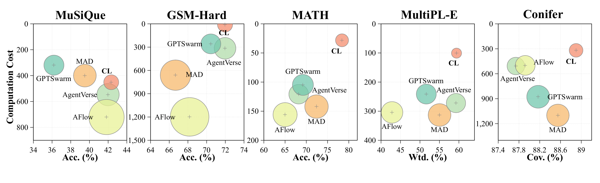
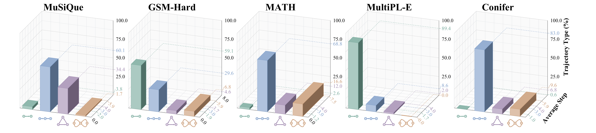

<h1 align="center">Reasoning across Sliced Models via Collaborative Learning</h1>

<p align="center">
  <a href="assets/figures/Figure1.pdf"></a>
</p>

<p align="center">
  <a href="#-overview">Overview</a>
  &nbsp;·&nbsp;
  <a href="#-evaluation">Evaluation</a>
  &nbsp;·&nbsp;
  <a href="#-workflow">Workflow</a>
  &nbsp;·&nbsp;
  <a href="#-repository-layout">Repository layout</a>
  &nbsp;·&nbsp;
  <a href="#-quickstart">Quickstart</a>
  &nbsp;·&nbsp;
  <a href="#-training-and-other-evaluations">Training and other evaluations</a>
  &nbsp;·&nbsp;
  <a href="#-documentation">Documentation</a>
</p>

## ✨ Overview

**Collaborative Learning (CL)** studies how sliced models can collaborate on reasoning while keeping the overall parameter budget comparable to a single larger model. The method combines model slicing, protocol distillation, and pyramid supervision so that models can build on shared task state across multiple reasoning steps.

This repository bundles the complete implementation and evaluation stack for the study: training code, benchmark scorers, result records, configurations, and analysis artifacts. It covers four task families—multi-hop question answering, mathematics, code generation, and constrained generation—across MuSiQue, GSM-Hard, MATH, MultiPL-E, and Conifer.

<p align="center">
  <a href="assets/figures/Figure2.pdf">
    
  </a>
</p>

## 🧪 Evaluation

We evaluate CL on four task families and five benchmarks:

| Task family | Benchmark | What it measures | Relevant paths |
| --- | --- | --- | --- |
| Multi-hop QA | [MuSiQue](https://github.com/StonyBrookNLP/musique) | Compositional retrieval and reasoning | <code>reproduction/code/jca/</code>, <code>reproduction/results/MuSiQue/</code> |
| Mathematical reasoning | **GSM-Hard** | Robust numerical reasoning | <code>reproduction/code/jca_homo_gsm/</code>, <code>reproduction/results/GSM-Hard/</code> |
| Mathematical reasoning | **MATH** | Competition-level problem solving | <code>reproduction/code/jca/experiments/math_specific_sft_rl_v1/</code>, <code>reproduction/results/MATH/</code> |
| Code generation | [MultiPL-E](https://github.com/nuprl/MultiPL-E) | Pass@1 across eight languages | <code>reproduction/code/jca/Code/MultiPL-E/</code>, <code>reproduction/results/MultiPL-E/</code> |
| Constrained generation | **Conifer** | Coverage and explicit constraint satisfaction | <code>reproduction/code/jca/conifer_training_hub/</code>, <code>reproduction/results/Conifer/</code> |

### 📊 Results

The table below compares CL with the main single-model and multi-model baselines. All values are percentages. MuSiQue, GSM-Hard, and MATH use **accuracy / F1**; MultiPL-E uses **weighted / macro-language pass@1**; Conifer uses **Coverage / Explicit**.

| Method | MuSiQue | GSM-Hard | MATH | MultiPL-E | Conifer |
| --- | ---: | ---: | ---: | ---: | ---: |
| Qwen3-14B | 39.55 / 49.70 | 68.94 / 80.69 | 74.60 / 82.86 | 55.18 / 57.34 | 88.00 / 95.72 |
| SE-RL | 41.76 / 52.73 | 68.18 / 79.67 | 76.00 / 80.70 | 60.43 / 62.55 | 88.00 / 95.81 |
| MAD | 39.51 / 50.59 | 66.67 / 74.18 | 72.40 / 81.32 | 55.03 / 55.35 | 88.55 / 95.84 |
| AgentVerse | 41.99 / 52.85 | 71.97 / 78.44 | 68.20 / 79.42 | 59.25 / 59.83 | 87.74 / 95.86 |
| AFlow | 41.83 / 50.36 | 68.18 / 76.04 | 65.00 / 76.53 | 42.83 / 42.46 | 87.92 / 96.51 |
| GPTSwarm | 36.20 / 47.37 | 70.45 / 78.39 | 69.20 / 79.90 | 51.63 / 52.43 | 88.17 / 95.96 |
| MAGRPO | 40.13 / 51.74 | 65.91 / 76.44 | 65.00 / 76.01 | 49.93 / 49.93 | 88.58 / 95.82 |
| MAPoRL | 40.59 / 52.74 | 63.64 / 75.34 | 70.80 / 80.87 | 53.25 / 53.27 | 86.37 / 89.19 |
| AT-GRPO | 41.54 / 53.51 | 64.39 / 76.86 | 74.20 / 83.70 | 57.91 / 58.74 | 86.60 / 95.85 |
| Homo. MAS | 26.40 / 32.82 | 71.21 / 79.93 | 68.20 / 76.41 | 56.36 / 57.20 | 88.02 / 94.27 |
| Homo. CL | 36.00 / 47.19 | 60.61 / 76.51 | 68.60 / 77.95 | 53.33 / 52.65 | 88.15 / 95.22 |
| **CL (ours)** | **42.37 / 53.43** | **71.97 / 81.15** | **78.40 / 85.25** | **59.39 / 59.63** | **88.90 / 95.90** |

<p align="center">
  <a href="assets/figures/Figure3.pdf">
    
  </a>
</p>

The evaluation records contain 2,417 MuSiQue examples, 132 GSM-Hard examples, 500 MATH problems, 1,352 MultiPL-E test problems, and 1,402 Conifer trajectories.

CL is best or joint-best on **6 of 10 metrics**, improves over Qwen3-14B on all ten, and gains an average of **2.38 percentage points** over that single-model reference. On the MATH evaluation, CL scores **392/500 correct**, or **78.40% accuracy and 85.25% F1**, under the evaluation scorer.

### 📉 Efficiency and task performance

Figure 4 compares task performance with parameter-weighted output cost and average model invocations across the five benchmarks.

<p align="center">
  <a href="assets/figures/Figure4.pdf"></a>
</p>

### 🧭 Emergent interaction topology

Figure 5 visualizes the task-dependent interaction topology. The model order changes with the task, allowing CL to draft, review, refine, enrich, or terminate as needed.

<p align="center">
  <a href="assets/figures/Figure5.pdf"></a>
</p>

## 🧭 Workflow

```text
task query + current reasoning state
                  |
                  v
          sliced model pool
                  |
                  v
           protocol decision
          /        |          \
     continue   handoff     terminate
        |          |            |
        +------> next model    v
                              final answer
                                   |
                                   v
                          task-specific evaluator
```

At each step, the current task state is processed by one model from the sliced-model pool. The learned protocol can continue the current thread, hand the state to another model, or terminate with a final answer. Protocol distillation provides coordination traces, pyramid supervision scores the reasoning process and final output, and each benchmark supplies a task-specific evaluator.

## 📦 Repository layout

| Path | Contents |
| --- | --- |
| `assets/figures/` | Released figures and GitHub previews |
| `reproduction/code/` | CL implementation, controls, baselines, evaluators, and analysis tools |
| `reproduction/results/` | Evaluation outputs, configurations, manifests, and logs |
| `reproduction/training/` | Training records and metrics |
| `reproduction/analysis/` | Saved analysis artifacts |

Each benchmark directory keeps its method name, configuration, scored records, and summaries together.

## 🚀 Quickstart

### 1️⃣ Clone the repository and fetch large files

The repository uses Git LFS for eight large Conifer score files.

~~~
git lfs install
git clone https://github.com/SJTUFreshman/tmp_x7k9p4r2d8m5c.git
cd tmp_x7k9p4r2d8m5c
git lfs pull
~~~

### 2️⃣ Recompute the MATH summary from the bundled records

This CPU-only path requires no dataset download, model server, or GPU.

~~~
python3 -m venv .venv
source .venv/bin/activate
python -m pip install --upgrade pip
python -m pip install sympy

python reproduction/code/jca/experiments/math_specific_sft_rl_v1/evaluate_main_table.py \
  summarize \
  --input reproduction/results/MATH/CL/math_specific_sft_rl_20260830/eval/results.jsonl \
  --output runs/math-main-table-summary.log
~~~

Use a new output path for each run. The scorer keeps the final answer from the three recorded protocol turns; for longer or non-terminating trajectories, it falls back to the first tentative answer. The fixed shard has SHA-256 <code>3d4b0649a1a4f6198ed22b138fb82b31d7339be65997af4175bf9bdcc6343183</code>.

### 3️⃣ Run a fresh MATH evaluation

For a fresh run, provide the external MATH parquet root, the original <code>shard_04.jsonl</code>, and three OpenAI-compatible endpoints for the final A1/A2/A3 adapters.

~~~
python -m pip install pandas pyarrow

python reproduction/code/jca/experiments/math_specific_sft_rl_v1/evaluate_main_table.py \
  run \
  --source-root /path/to/MATH \
  --shard-file /path/to/test_10x500_seed42/shard_04.jsonl \
  --output-root runs/math-cl-new \
  --api-base-a1 http://127.0.0.1:8201/v1 --api-model-a1 A1 \
  --api-base-a2 http://127.0.0.1:8212/v1 --api-model-a2 A2 \
  --api-base-a3 http://127.0.0.1:8223/v1 --api-model-a3 A3
~~~

The source root must contain one subject directory per MATH subject, each with <code>test-00000-of-00001.parquet</code>. The runner creates a new output root, builds the shard, initializes the evaluation, runs the endpoints, and writes the score summary. Authentication comes from the client environment or <code>--api-key</code>; credentials are not stored here.

## 🧰 Training and other evaluations

| Area | Entry point |
| --- | --- |
| Shared CL utilities and analysis | <code>reproduction/code/jca/scripts/</code> |
| MATH CL training and evaluation | <code>reproduction/code/jca/experiments/math_specific_sft_rl_v1/</code> |
| Conifer pipeline | <code>reproduction/code/jca/conifer_training_hub/</code> |
| MultiPL-E scoring | <code>reproduction/code/jca/Code/MultiPL-E/</code> |
| Homogeneous controls | <code>reproduction/code/jca_homo_gsm/</code>, <code>reproduction/code/jca_homo_math/</code> |
| Baseline methods | <code>reproduction/code/AT-GRPO/</code>, <code>reproduction/code/MAGRPO/</code>, <code>reproduction/code/MAPoRL/</code> |
| Saved training records | <code>reproduction/training/</code> |

The repository does not use a single environment lockfile. A full run may require Python 3.10+, PyTorch/CUDA, Transformers, PEFT, Accelerate, vLLM, language runtimes, and benchmark-specific evaluators. Use the checked-in configurations and logs for paths, seeds, model servers, and output conventions.

The MATH training chain is an external-resource workflow: `00_build_sft_data.sh` → `01_train_sft.sh` → `02_reuse_sampled_rl.sh` → `03_score_rl.sh` → `04_prepare_rl.sh` → `05_train_rl.sh` → `06_eval_suite.sh`. These stages require model checkpoints, benchmark data, GPU workers, and endpoint settings from `config.env`. For a fresh checkout, start with the CPU-only scorer in Quickstart.

## 📚 Documentation

- [`reproduction/code/jca/experiments/math_specific_sft_rl_v1/evaluate_main_table.py`](reproduction/code/jca/experiments/math_specific_sft_rl_v1/evaluate_main_table.py): consolidated MATH `run` and `summarize` commands.
- [`reproduction/code/jca/experiments/math_specific_sft_rl_v1/06_eval_suite.sh`](reproduction/code/jca/experiments/math_specific_sft_rl_v1/06_eval_suite.sh): shell wrapper for a fresh MATH evaluation.
- [`reproduction/code/jca/scripts/`](reproduction/code/jca/scripts/): shared rollout, serving, evaluation, and analysis utilities.
