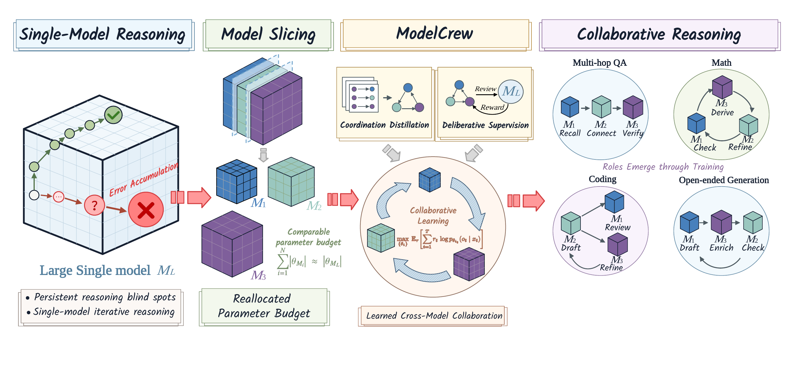

# Reallocating Reasoning across Models via Learned Collaboration

This repository is the curated reproduction release for **Collaborative Learning (CL)**, a heterogeneous multi-agent reasoning system. It contains the selected experiment implementations, benchmark-specific evaluators, paper-result records, configurations, analysis outputs, logs, and the five rendered figures used in the paper.

The release is intentionally focused on the experiments reported in the paper. It does not include the manuscript source, model weights, adapter checkpoints, benchmark datasets, teacher pools, or unrelated historical debugging material.

## What the method does

CL reallocates the parameter budget of a single large model across three independently parameterized collaborators:

- Qwen3-1.7B (A1), Qwen3-4B (A2), and Qwen3-8B (A3), totaling 13.7B parameters;
- explicit handoffs of task state, so each model can question, extend, revise, or preserve another model's reasoning;
- pyramid supervision, which combines protocol distillation, step-level deliberative scores, and task-level rewards.

The paper evaluates this system on five tasks: multi-hop question answering (MuSiQue), mathematical reasoning (GSM-Hard and MATH), code generation (an eight-language MultiPL-E subset), and constrained generation (Conifer).

## Paper figures

The original rendered figures are available for reuse. They are kept as standalone PDFs; the paper's TeX, BibTeX, style files, and figure-generation source are not part of this repository.

| Figure | Description | File |
| --- | --- | --- |
| 1 | Model slicing and learned collaboration | [Figure1.pdf](assets/figures/Figure1.pdf) |
| 2 | Collaborative-learning and pyramid-supervision overview | [Figure2.pdf](assets/figures/Figure2.pdf) |
| 3 | Ablation study across the five benchmarks | [Figure3.pdf](assets/figures/Figure3.pdf) |
| 4 | Computation cost versus task performance | [Figure4.pdf](assets/figures/Figure4.pdf) |
| 5 | Post-training interaction topology | [Figure5.pdf](assets/figures/Figure5.pdf) |

### Figure previews

Click a preview to open the original PDF.

## Reported results

The table below records the paper's main comparison. Values are percentages and are shown as **first metric / second metric**: accuracy / F1 for MuSiQue, GSM-Hard, and MATH; weighted / macro-language pass@1 for MultiPL-E; and Coverage / Explicit for Conifer.

| Method | MuSiQue | GSM-Hard | MATH | MultiPL-E | Conifer |
| --- | ---: | ---: | ---: | ---: | ---: |
| Qwen3-14B | 39.55 / 49.70 | 68.94 / 80.69 | 74.60 / 82.86 | 55.18 / 57.34 | 88.00 / 95.72 |
| SE-RL | 41.76 / 52.73 | 68.18 / 79.67 | 76.00 / 80.70 | 60.43 / 62.55 | 88.00 / 95.81 |
| MAD | 39.51 / 50.59 | 66.67 / 74.18 | 72.40 / 81.32 | 55.03 / 55.35 | 88.55 / 95.84 |
| AgentVerse | 41.99 / 52.85 | 71.97 / 78.44 | 68.20 / 79.42 | 59.25 / 59.83 | 87.74 / 95.86 |
| AFlow | 41.83 / 50.36 | 68.18 / 76.04 | 65.00 / 76.53 | 42.83 / 42.46 | 87.92 / 96.51 |
| GPTSwarm | 36.20 / 47.37 | 70.45 / 78.39 | 69.20 / 79.90 | 51.63 / 52.43 | 88.17 / 95.96 |
| MAGRPO | 40.13 / 51.74 | 65.91 / 76.44 | 65.00 / 76.01 | 49.93 / 49.93 | 88.58 / 95.82 |
| MAPoRL | 40.59 / 52.74 | 63.64 / 75.34 | 70.80 / 80.87 | 53.25 / 53.27 | 86.37 / 89.19 |
| AT-GRPO | 41.54 / 53.51 | 64.39 / 76.86 | 74.20 / 83.70 | 57.91 / 58.74 | 86.60 / 95.85 |
| Homo. MAS | 26.40 / 32.82 | 71.21 / 79.93 | 68.20 / 76.41 | 56.36 / 57.20 | 88.02 / 94.27 |
| Homo. CL | 36.00 / 47.19 | 60.61 / 76.51 | 68.60 / 77.95 | 53.33 / 52.65 | 88.15 / 95.22 |
| **CL (ours)** | **42.37 / 53.43** | **71.97 / 81.15** | **78.40 / 85.25** | **59.39 / 59.63** | **88.90 / 95.90** |

CL is best or joint-best on six of the ten reported metrics and improves on Qwen3-14B across all ten. These values are the paper's reported results; they should not be interpreted as a claim that every historical experiment was rerun while preparing this release.

## Repository layout

~~~text
assets/
  figures/                  Rendered paper figures (PDF only)
reproduction/
  code/                     Selected experiment implementations and evaluators
    jca/                    CL code, shared utilities, benchmark evaluators, analyses
    jca_homo_gsm/           Homogeneous GSM-Hard implementation
    jca_homo_math/          Homogeneous MATH implementation
    jca_homo_launchers/     Homogeneous launchers
    MAGRPO/                 MAGRPO baseline
    MAPoRL/                 MAPoRL baseline
    AT-GRPO/                AT-GRPO baseline
    math_se_rl/             MATH self-evaluated RL implementation
  results/                  Selected paper-result records, configs, and logs
  training/                 Selected training records and summaries
  analysis/                 Saved analysis artifacts
~~~

The retained files are grouped by MuSiQue, GSM-Hard, MATH, MultiPL-E, and Conifer. The MATH entry point and related evaluators are in reproduction/code/jca/experiments/math_specific_sft_rl_v1/. Shared analysis utilities are in reproduction/code/jca/analysis/.

## Download the release

Several result files are large and are tracked with Git LFS.

~~~bash
git lfs install
git clone https://github.com/SJTUFreshman/tmp_x7k9p4r2d8m5c.git
cd tmp_x7k9p4r2d8m5c
git lfs pull
~~~

If a JSONL file contains only a short LFS pointer instead of its recorded content, run git lfs pull before scoring.

## Quickstart: score the stored MATH result

This CPU-only command recomputes the MATH CL main-table metrics from the retained result records. It does not need a GPU, a model server, or a benchmark download.

~~~bash
python3 -m venv .venv
source .venv/bin/activate
python -m pip install --upgrade pip
python -m pip install sympy

python reproduction/code/jca/experiments/math_specific_sft_rl_v1/evaluate_main_table.py \
  summarize \
  --input reproduction/results/MATH/CL/math_specific_sft_rl_20260830/eval/results.jsonl \
  --output runs/math-main-table-summary.log
~~~

The expected summary is **500 problems, 392 correct, 78.40% accuracy, and 85.25% F1**. The command writes a separate summary, records the input hash and scorer version, and leaves the retained JSONL unchanged. The output path must not already exist.

The paper rule keeps the final answer within the three recorded protocol turns. Trajectories that exceed the limit, or reach the limit without a successful stop, fall back to their first tentative answer. The retained evaluation.log is a consolidated scoring summary of the stored records and should be read as such rather than as a raw execution transcript.

## Run a new MATH evaluation

The run subcommand starts a fresh evaluation against external MATH parquet files and three already-running OpenAI-compatible model endpoints. It requires the intended Qwen3-1.7B, Qwen3-4B, and Qwen3-8B adapters, plus the original fixed shard.

~~~bash
python -m pip install pandas pyarrow

python reproduction/code/jca/experiments/math_specific_sft_rl_v1/evaluate_main_table.py \
  run \
  --source-root /path/to/MATH \
  --shard-file /path/to/test_10x500_seed42/shard_04.jsonl \
  --output-root runs/math-cl-new \
  --api-base-a1 http://127.0.0.1:8201/v1 --api-model-a1 A1 \
  --api-base-a2 http://127.0.0.1:8212/v1 --api-model-a2 A2 \
  --api-base-a3 http://127.0.0.1:8223/v1 --api-model-a3 A3
~~~

source-root must contain one MATH subject directory per subject, each with test-00000-of-00001.parquet. The fixed shard used by this release has SHA-256 3d4b0649a1a4f6198ed22b138fb82b31d7339be65997af4175bf9bdcc6343183. The endpoints must support the runner's structured JSON requests. Provide authentication through the environment variables supported by the selected client; credentials are not stored in this repository.

The runner creates a new output directory, generates raw records, finalizes them, and writes the same paper-rule score summary. It does not reuse an existing output directory. The shell wrapper 06_eval_suite.sh accepts the same arguments after the run subcommand.

## Other benchmarks and training

The release keeps benchmark-specific launchers and evaluators together with the selected records that support the paper table.

| Area | Starting point |
| --- | --- |
| CL and shared evaluation utilities | reproduction/code/jca/scripts/ |
| MATH CL | reproduction/code/jca/experiments/math_specific_sft_rl_v1/ |
| Conifer | reproduction/code/jca/conifer_training_hub/ |
| MultiPL-E evaluators | reproduction/code/jca/Code/MultiPL-E/ |
| Multi-agent baselines | reproduction/code/jca/baseline/ |
| Training records | reproduction/training/ |

There is no single environment lockfile for all experiments. Depending on the benchmark, a run may need Python 3.10+, PyTorch/CUDA, Transformers, PEFT, Accelerate, vLLM, language runtimes, or the evaluator container used by MultiPL-E. Before launching a job, use the retained configuration and logs to set local dataset, adapter, interpreter, and output paths; server-specific paths in individual scripts are historical experiment settings.

## Release boundaries

The following are deliberately obtained separately and are not included here:

- base-model weights, LoRA/adapters, and checkpoints;
- benchmark datasets and the teacher-model pool;
- SFT/RL training inputs and other external private resources;
- manuscript TeX/BibTeX sources and unrelated historical scripts or logs.

The rendered figures in assets/figures/ are the exception: they are included because they are reusable paper artifacts and do not require the manuscript source to view. Public code has had embedded API-key and authenticated-proxy defaults removed; use environment variables or local configuration when a selected script requires credentials, and do not commit secrets.

## Citation

If you use this release, cite **Reallocating Reasoning across Models via Learned Collaboration** and identify the benchmark, result record, and code entry point used. The repository contains the artifacts needed to inspect the reported results, while the manuscript source remains outside the release.
